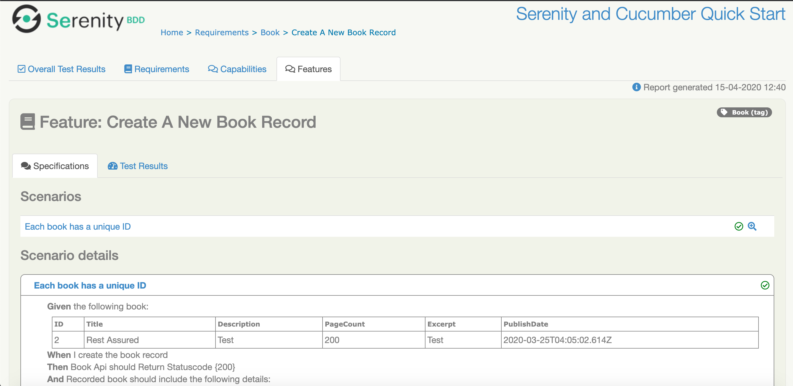

# README

### Api Testing Framework based on Serenity-BDD with Cucumber4 flavour build on top of Rest Assured Library.


Dummy open Api's (Book, Employee) have been used to automate with serenity bdd with cucumber4 build on top of Rest Assured Framework.


 `Pre-Requisites`

 ```diff

- JAVA8 or above

- Maven3 or above

- IDE - Eclipse/IntelliJ

```


 `Installation`

 ```diff
 
- git clone project

- import as maven project in your respective IDE

Command Line

- cd api-test-serenity-bdd

- mvn clean compile
```

 `RUN TESTS`

 

```diff
mvn verify -Denvironment=dev/stage/test
```
 

 Note:
  For now only dev env has been populated, properties can be added in /src/resources/serenity.conf file for each environment
 
 
 ### Test Data

Test data has been defined in feature files which are processed with corresponding json templates defined in resources/templates


## Test Report
Test report is generated at /Project Directory/target/site/serenity/index.html

 `Sample Report Screenshot `





## TBD/WIP

- Cucumber 5 Update
- Dependencies Update
- CI Build

## Contributions

Pull requests are welcome. For major changes, please open an issue first to discuss what you would like to change.

Please make sure to update tests as appropriate.
